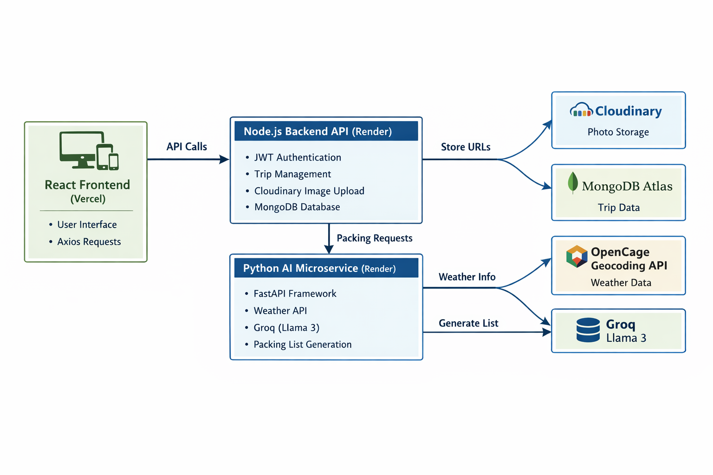
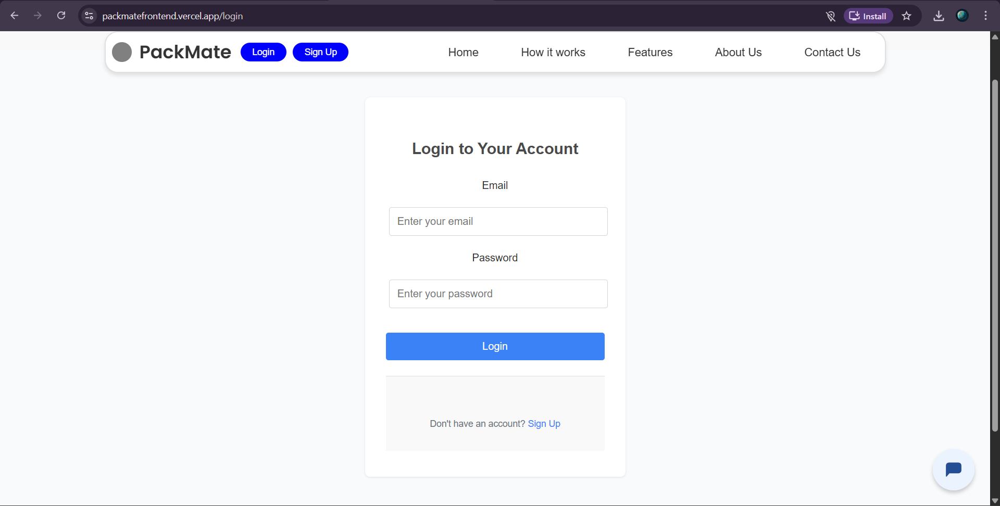
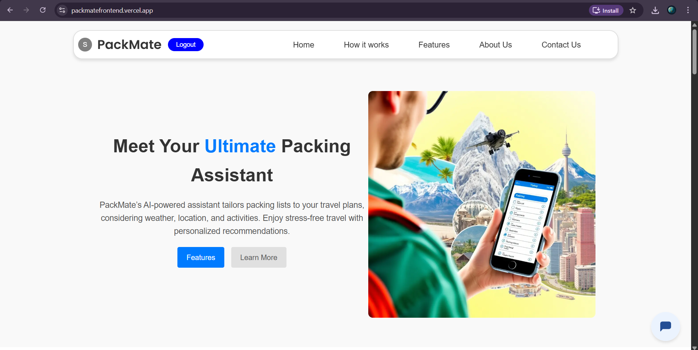
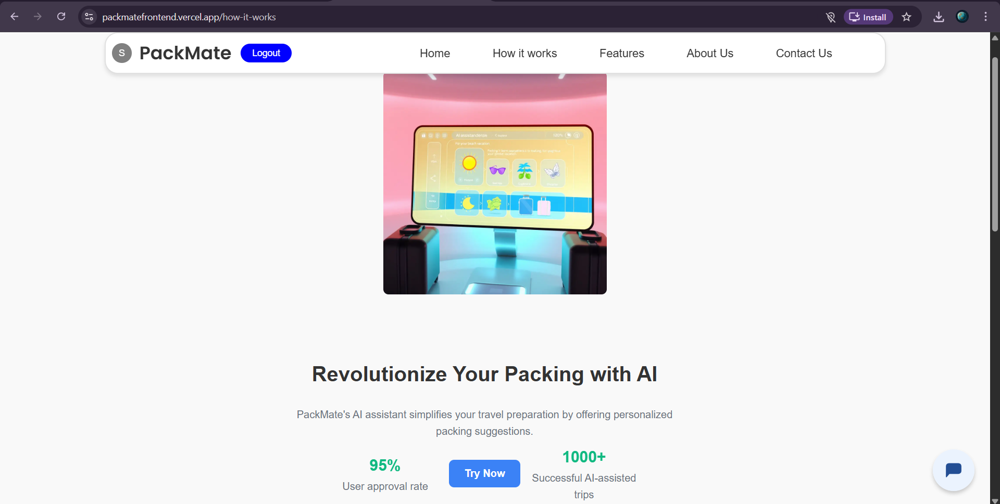
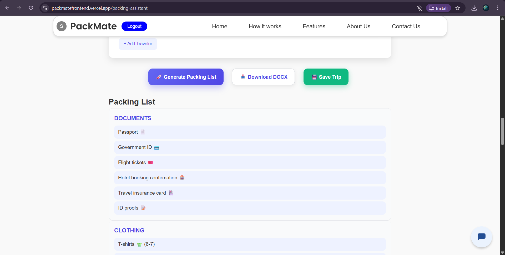
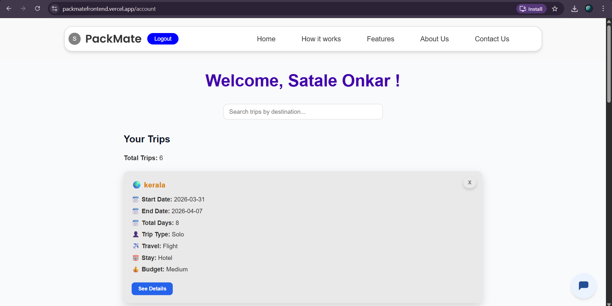
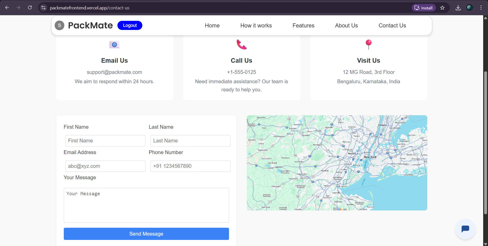

# 🌍 PackMate: AI-Powered Travel Assistant

PackMate is a **full-stack, AI-powered travel assistant** that helps users plan trips, manage itineraries, and generate intelligent, context-aware packing lists using real-time weather and Generative AI.

It combines a **React frontend**, **Node.js backend**, and a **Python FastAPI microservice** to build a scalable, production-ready system.

---

## 🎯 Problem Statement

Planning trips is complex:

- People forget essential items  
- Packing depends on weather, duration, and activities  
- Manual planning is time-consuming  

👉 PackMate solves this by:

- Automating packing list generation using AI  
- Providing a centralized platform for trip planning  

---

## ✨ Features

- 🔐 **User Authentication** — Secure login/signup using JWT & bcrypt  
- 🗺️ **Trip Management** — Store destination, dates, budget, travelers, and notes  
- 🤖 **AI Packing Assistant** — Generates structured packing lists using LLM  
- 🌦️ **Weather Integration** — Uses live weather data  
- 📄 **Export to DOCX** — Download packing list as a Word file  
- 📸 **Cloud Photo Storage** — Upload images using Cloudinary  
- 📝 **Trip Notes** — Add journaling and notes  
- ✅ **Interactive Packing List** — Check off items  
- 📱 **Responsive UI** — Works across devices  

---

## 🏗️ System Architecture

PackMate follows a **microservices-inspired architecture**:

### 🔹 Frontend (React - Vercel)
- UI rendering  
- State management  
- API communication  

### 🔹 Backend API (Node.js - Render)
- JWT Authentication  
- Trip CRUD operations  
- MongoDB integration  
- Cloudinary image uploads  

### 🔹 GenAI Microservice (Python FastAPI - Render)
- Weather fetching (OpenCage API)  
- Prompt engineering  
- AI integration (Groq - Llama 3)  
- Packing list generation  
- DOCX export  

---

## 🖼️ System Design


*High-level architecture of PackMate showing frontend, backend, and AI microservice integration.*

---

## 📸 PackMate Screenshots

### 🔑 Login Page

*Secure login using JWT and password hashing.*

### 🏠 Landing Page

*Main landing page with light/dark mode toggle.*

### 💡 How It Works

*Illustrates the AI packing list workflow.*

### 📋 Generating Packing List

*AI generates a structured packing list based on trip details.*

### 👤 Account Page

*User account page showing profile and settings.*

### 📞 Contact Page

*Contact form for connecting with users.*

## 🔄 Data Flow (AI Packing List)

1. User enters trip details  
2. Frontend sends request → FastAPI  
3. FastAPI:
   - Fetches weather (OpenCage)  
   - Builds prompt  
   - Calls Groq (Llama 3)  
4. AI generates packing list  
5. Response returned to frontend  
6. User saves trip → Node backend → MongoDB  

---

## 🧠 Key Technical Decisions

### 🔹 Microservices Architecture
- Node.js → API & DB  
- Python → AI processing  
- Ensures separation of concerns  

### 🔹 Cloudinary for Image Storage
- Avoids Render storage issues  
- Stores only URLs in DB  

### 🔹 Embedded MongoDB Schema
- Faster reads  
- No joins required  

### 🔹 Rate Limiting
- Prevents API abuse  
- Protects AI endpoints  

---

## ⚡ Performance & Scalability

### Current Limitations
- AI latency due to external APIs  
- Render cold starts (~30s delay)  

### Future Improvements
- Redis caching  
- CDN integration  
- AWS S3 storage  

---

## 🔐 Security

- JWT-based authentication  
- Password hashing (bcrypt)  
- Rate limiting  
- Input validation  

---

## 🚀 Live Demo

- Frontend: https://packmatefrontend.vercel.app  
- Backend: https://packmate-backend.onrender.com  
- AI Service: https://packmate69.onrender.com  

⚠️ Render free tier may take ~30 seconds to wake up  

---

## 🛠️ Tech Stack

### Frontend
- React.js  
- Axios  
- React Router  

### Backend
- Node.js  
- Express.js  
- MongoDB + Mongoose  

### AI Microservice
- Python  
- FastAPI  
- Groq (Llama 3)  
- OpenCage API  
- python-docx
  
---

### 🚀 Deployment

- **Frontend** → Vercel  
- **Backend API (Node.js / Express)** → Render  
- **GenAI Microservice (FastAPI / Python)** → Render  
- **Database (MongoDB Atlas)** → Cloud (Managed Database)  
- **Image Storage** → Cloudinary
  
  ⚠️ Note: Render free tier services may take ~30 seconds to wake up after inactivity.

---
## 🛠️ Local Setup

### 🔹 Backend

```bash
cd backend
npm install
npm start
```


🔹 GenAI Service
```bash
cd genai
python -m venv venv
```

---

# Windows
```bash
venv\Scripts\activate
```

# Mac/Linux
```bash
source venv/bin/activate
pip install -r requirements.txt
uvicorn main:app --reload --port 8000
```

---

🔹 Frontend
```bash
cd frontend
npm install
npm start
```

---

### 📂 Project Structure

PackMate/
 -┣ backend/
 -┣ frontend/
 -┣ genai/

---
 
### 🚧 Future Improvements

- AWS S3 / Cloudinary optimization
- Real-time collaboration (WebSockets)
- Redis caching
- PDF export

---

### 🎯 Key Highlights

- Full-stack + AI integration  
- Microservices architecture  
- Real-world problem solving  
- Production-ready improvements  
- Clean UX + scalable design  

----

### 🛡️ License
MIT License
